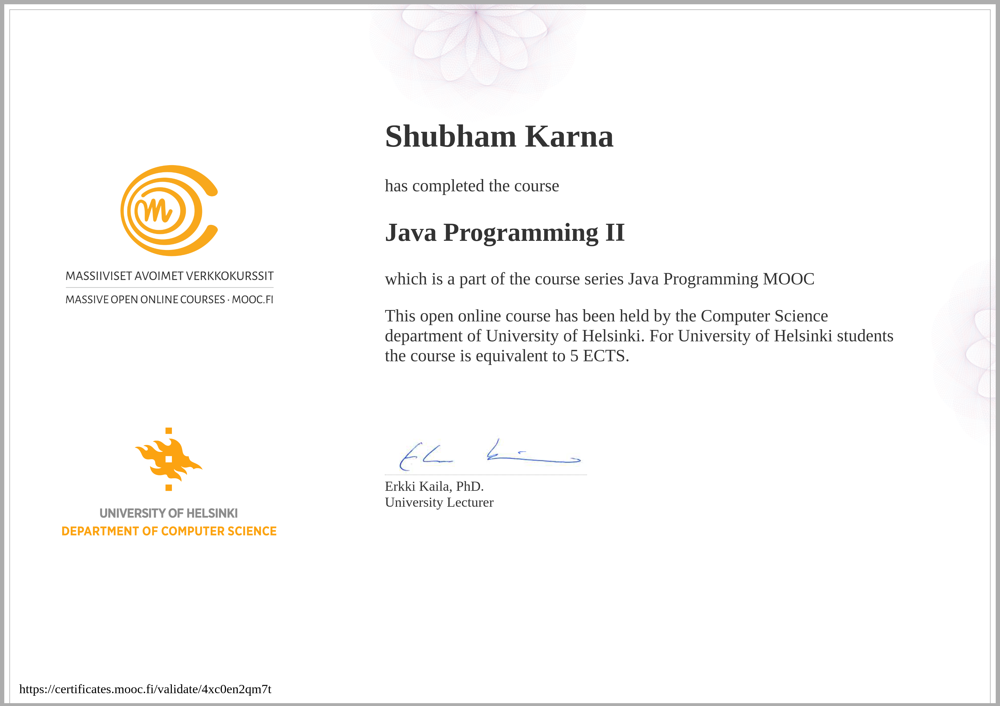

# ☕ Java Programming - University of Helsinki MOOC


## 📖 About This Repository

This repository contains my complete solutions and projects from the **Java Programming MOOC** offered by the University of Helsinki. This is one of the most comprehensive and well-regarded free Java courses available, covering everything from basic syntax to advanced object-oriented programming concepts.

### 🎓 Course Information
- **Institution:** University of Helsinki
- **Platform:** [MOOC.fi](https://java-programming.mooc.fi/)
- **Language:** Java
- **Parts Completed:** Part 1 & Part 2 (Full Course)
- **Certificates:** ✅ Both Parts Certified

---

## ⚠️ Academic Integrity Disclaimer

**IMPORTANT - READ BEFORE PROCEEDING:**

This repository contains my personal solutions to the Java MOOC course exercises. It is made public for the following purposes:
- 📂 **Portfolio showcase** - Demonstrating my learning journey and coding skills
- 📚 **Personal reference** - Serving as my own documentation and revision material
- 🤝 **Inspiration** - Helping others understand different approaches to problem-solving

### 🚫 What This Repository Is NOT:
- ❌ A source for copying solutions to submit as your own work
- ❌ A shortcut to bypass the learning process
- ❌ A substitute for doing the exercises yourself

### ✅ Ethical Use Guidelines:
If you're currently taking this course:
1. **Attempt exercises independently first** - Struggle is part of learning
2. **Use as a last resort** - Only after genuine attempts and research
3. **Understand, don't copy** - Read to understand concepts, then write your own code
4. **Respect the honor code** - The course relies on academic integrity

> **Quote from Helsinki MOOC:**
> *"We expect students to submit solutions that are the result of their own work. If you use this repository, make sure you're learning, not just copying."*

**Remember:** Employers value problem-solving skills, not copied code. The struggle is where the learning happens! 💪

---

## 🏆 Certificates

<div align="center">

### Java Programming I


### Java Programming II  


</div>

---

## 📚 Course Structure

### Part 1: Java Programming I
**Focus:** Programming Fundamentals

<details>
<summary><b>Topics Covered (Click to expand)</b></summary>

- **Week 1:** Getting Started, Variables, Input/Output
- **Week 2:** Conditionals (if/else), Comparison operators
- **Week 3:** Loops (while, for), Breaking loops
- **Week 4:** Methods, Parameters, Return values
- **Week 5:** Lists, Arrays, String manipulation
- **Week 6:** Object-Oriented Programming basics
- **Week 7:** Classes, Objects, Methods in classes

**Key Concepts Mastered:**
- ✅ Variables, data types, and operators
- ✅ Control flow (if/else, loops)
- ✅ Methods and code organization
- ✅ Collections (ArrayList)
- ✅ Introduction to OOP
- ✅ File reading and basic I/O

</details>

### Part 2: Java Programming II  
**Focus:** Advanced Object-Oriented Programming

<details>
<summary><b>Topics Covered (Click to expand)</b></summary>

- **Week 8:** HashMap, Key-value pairs, Data structures
- **Week 9:** Inheritance, Interfaces, Polymorphism
- **Week 10:** Abstract classes, Object equality
- **Week 11:** Exceptions, File handling, Reading data
- **Week 12:** Algorithms, Sorting, Complexity
- **Week 13:** Graphical User Interfaces (JavaFX)
- **Week 14:** Maven, Testing, Final project

**Key Concepts Mastered:**
- ✅ Advanced data structures (HashMap, HashSet)
- ✅ Inheritance hierarchies
- ✅ Interface implementation
- ✅ Exception handling
- ✅ File I/O operations
- ✅ Algorithm design and analysis
- ✅ GUI development with JavaFX
- ✅ Unit testing
- ✅ Project structure and dependencies (Maven)

</details>

---

## 📊 Learning Stats

```
✅ Total Exercises Completed: 200+
✅ Parts Completed: 2/2 (100%)
✅ Certificates Earned: 2
✅ Lines of Code Written: ~5000+
✅ Projects Built: 15+
✅ Bugs Fixed: Countless 😅
✅ Coffee Consumed: Industrial quantities ☕
```

---

## 🗂️ Repository Structure

```
java-mooc-helsinki/
│
├── README.md                           # You are here!
│
├── certificates/                       # Course completion certificates
│   ├── certificate-java-programming-i.png
│   └── certificate-java-programming-ii.png
│
├── part-1/                            # Java Programming I exercises
│   ├── part01/                        # Week 1 exercises
│   ├── part02/                        # Week 2 exercises
│   ├── part03/                        # Week 3 exercises
│   ├── part04/                        # Week 4 exercises
│   ├── part05/                        # Week 5 exercises
│   ├── part06/                        # Week 6 exercises
│   └── part07/                        # Week 7 exercises
│
└── part-2/                            # Java Programming II exercises
    ├── part08/                        # Week 8 exercises
    ├── part09/                        # Week 9 exercises
    ├── part10/                        # Week 10 exercises
    ├── part11/                        # Week 11 exercises
    ├── part12/                        # Week 12 exercises
    ├── part13/                        # Week 13 exercises (JavaFX)
    └── part14/                        # Week 14 exercises & Final project
```

---

## 🛠️ Technologies & Tools Used

- **Language:** Java (SE 11+)
- **IDE:** NetBeans IDE / IntelliJ IDEA / VS Code
- **Build Tool:** Maven
- **Testing Framework:** JUnit
- **GUI Framework:** JavaFX (Part 2)
- **Version Control:** Git & GitHub

---

## 🚀 How to Run These Projects

### Prerequisites
- Java JDK 11 or higher installed
- NetBeans IDE (recommended) or any Java IDE
- Maven (usually bundled with IDEs)

### Running an Exercise

#### Option 1: Using NetBeans
```bash
1. Open NetBeans IDE
2. File → Open Project
3. Navigate to the exercise folder (e.g., part-1/part01/Part01_01.Sandbox)
4. Right-click project → Run
```

#### Option 2: Using Command Line
```bash
# Navigate to exercise directory
cd part-1/part01/Part01_01.Sandbox

# Compile
javac src/main/java/Sandbox.java

# Run
java -cp src/main/java Sandbox
```

#### Option 3: Using Maven
```bash
# Navigate to exercise directory
cd part-1/part01/Part01_01.Sandbox

# Run with Maven
mvn compile exec:java
```

---

## 💡 Key Takeaways & Lessons Learned

### Technical Skills
1. **Solid Java Foundation:** From variables to advanced OOP concepts
2. **Problem Decomposition:** Breaking complex problems into manageable pieces
3. **Clean Code Practices:** Writing readable, maintainable code
4. **Testing Mindset:** Unit testing and test-driven development
5. **Error Handling:** Proper exception handling and debugging

### Soft Skills
1. **Persistence:** Debugging teaches patience and systematic thinking
2. **Self-Learning:** Reading documentation and finding solutions independently
3. **Attention to Detail:** Syntax matters, edge cases matter
4. **Time Management:** Balancing multiple exercises and concepts

### Best Practices Adopted
- 📝 Meaningful variable names
- 🔄 DRY (Don't Repeat Yourself) principle
- 🧪 Test-driven development approach
- 📚 Proper code documentation
- 🎯 Single Responsibility Principle in methods

---

## 🎯 Favorite Exercises & Projects

### Part 1 Highlights
- **Advent Calendar** - Creating a calendar with dynamic dates
- **Name Collection** - Working with user input and lists
- **Text Adventure Game** - Implementing game logic with OOP

### Part 2 Highlights
- **Dictionary** - Building a translation application with HashMaps
- **Animals** - Implementing inheritance hierarchies
- **Flight Control** - Complex system with multiple classes and relationships
- **To-Do Application** - GUI application with JavaFX

---

## 📈 Progress Through the Course

| Part | Status | Exercises | Difficulty | Time Invested |
|------|--------|-----------|------------|---------------|
| Part 1 (Weeks 1-7) | ✅ Complete | ~100 | ⭐⭐ Beginner | ~60 hours |
| Part 2 (Weeks 8-14) | ✅ Complete | ~100 | ⭐⭐⭐ Intermediate | ~80 hours |

---

## 🤔 Why This Course?

The University of Helsinki Java MOOC is renowned for:
- 🎓 **University-Level Quality:** Academic rigor without the price tag
- 📊 **Comprehensive Curriculum:** Covers everything from basics to advanced concepts
- 🧪 **Hands-On Learning:** 200+ practical exercises
- 🤖 **Automated Testing:** Instant feedback on solutions
- 🌍 **Global Recognition:** Respected by employers worldwide
- 💯 **Free Certification:** Official certificates from a top university

---

## 🔗 Useful Resources

- 📖 [Course Website](https://java-programming.mooc.fi/)
- 📚 [Java Documentation](https://docs.oracle.com/en/java/)
- 💬 [Course Discord Community](https://study.cs.helsinki.fi/discord/join/ohjelmoinnin_mooc)
- 🎥 [Supplementary Videos](https://www.youtube.com/c/moocfi)

---

## 🤝 Contributing

While this is a personal learning repository, feel free to:
- Report issues or bugs in my solutions
- Suggest better approaches or optimizations
- Share your own learning experiences

**Note:** Please don't submit PRs with exercise solutions, as this should remain a personal portfolio.

---

## 📄 License

This repository is for educational purposes. The course material belongs to the University of Helsinki. My solutions are shared under the [MIT License](LICENSE) for reference purposes only.

**Respect academic integrity** - Use this as a learning resource, not a solution bank.

---

## 🙏 Acknowledgments

- **University of Helsinki** - For providing this exceptional free course
- **MOOC.fi Team** - For the excellent platform and automated testing system
- **Course Instructors** - For clear explanations and well-designed exercises
- **Student Community** - For support and discussions on Discord
- **My Debugging Partner** - Stack Overflow (when needed 😄)

---

## 📬 Connect With Me

If you're also learning Java or have completed this course:
- Open an issue to discuss solutions or concepts
- Star ⭐ this repo if you found it helpful!
- 🐦 Twitter: [@karna_shubham](https://twitter.com/karna_shubham)
- 📷 Instagram: [@i_shubham_karna](https://www.instagram.com/i_shubham_karna)

---

<div align="center">

**☕ From Zero to Java Hero | MOOC Helsinki Graduate 🎓**

*"The only way to learn a new programming language is by writing programs in it."* - Dennis Ritchie

Made with ☕, 💻, and lots of debugging sessions

</div>

---

## 🎯 What's Next?

Having completed this course, I'm now exploring:
- 🌱 Spring Framework & Spring Boot
- 🗄️ Database integration with JDBC/JPA
- 🔧 Advanced design patterns
- 🚀 Building production-ready applications

Stay tuned for more projects! 🚀